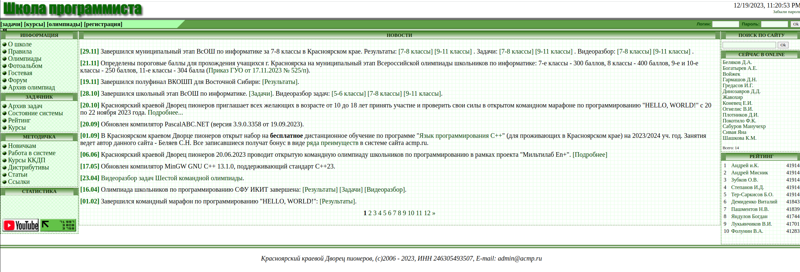
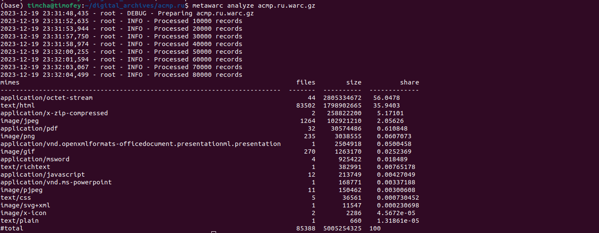

# acmp.ru

## О сайте

Как уже было сказано, [`acmp.ru`](https://acmp.ru/) - сайт с достаточно большой базой задач по программированию уровня школьных олимпиад и выше.

Так выглядит главная страница сайта:


Все данные, полученные после архивации, лежат [здесь](https://drive.google.com/drive/folders/19jXYv-HrM6gKSzZYRgYf8gNu2pGsmy8N?usp=sharing)

## Метаданные

Пользуемся инструментом [`metawarc`](https://github.com/datacoon/metawarc).

### `metadata`
Теперь посмотрим на результат выполнения метода `metadata`.

Запускаем его следующей командой:
```bash
metawarc metadata --output acmp.jsonl acmp.ru.warc.gz
```

В итоге были собраны следующие метаданные (представлен сниппет):
```json
{"filename": "144x144.png", "ext": "png", "url": "https://acmp.ru/images/144x144.png", "mime": "image/png", "metadata": {"Metadata": {"Image width": "144 pixels", "Image height": "144 pixels", "Bits/pixel": "32", "Pixel format": "RGBA", "Compression rate": "11.3x", "Compression": "deflate", "Producer": "Adobe ImageReady", "MIME type": "image/png", "Endianness": "Big endian"}}, "error": false, "source": "acmp.ru.warc.gz"},

{"filename": "192x192.png", "ext": "png", "url": "https://acmp.ru/images/192x192.png", "mime": "image/png", "metadata": {"Metadata": {"Image width": "192 pixels", "Image height": "192 pixels", "Bits/pixel": "32", "Pixel format": "RGBA", "Compression rate": "14.9x", "Compression": "deflate", "Producer": "Adobe ImageReady", "MIME type": "image/png", "Endianness": "Big endian"}}, "error": false, "source": "acmp.ru.warc.gz"},

{"filename": "youtube.png", "ext": "png", "url": "https://acmp.ru/images/youtube.png", "mime": "image/png", "metadata": {"Metadata": {"Image width": "88 pixels", "Image height": "31 pixels", "Bits/pixel": "32", "Pixel format": "RGBA", "Compression rate": "3.2x", "Compression": "deflate", "Producer": "Adobe ImageReady", "MIME type": "image/png", "Endianness": "Big endian"}}, "error": false, "source": "acmp.ru.warc.gz"}
```


### `analyze`
Теперь посмотрим на результат выполнения метода `analyze`.

Запускаем его следующей командой:
```bash
 metawarc analyze acmp.ru.warc.gz
```

Получились следующее:

