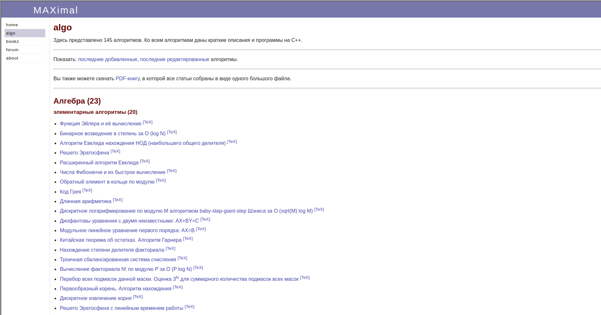
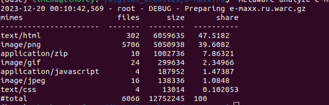

# acmp.ru

## О сайте

Как уже было сказано, [`e-maxx.ru`](https://e-maxx.ru/algo/) - один из самых популярных сайтов с описанием алгоритмов.

Так выглядит главная страница сайта:


Все данные, полученные после архивации, лежат [здесь](https://drive.google.com/drive/folders/1mdad9lz5NnQ-srCCPyVi25NNVlo6VQ3H?usp=sharing)

## Метаданные

Пользуемся инструментом [`metawarc`](https://github.com/datacoon/metawarc).

### `metadata`
Теперь посмотрим на результат выполнения метода `metadata`.

Запускаем его следующей командой:
```bash
metawarc metadata --output e-maxx.jsonl e-maxx.ru.warc.gz
```

В итоге были собраны следующие метаданные (представлен сниппет):
```json
{"filename": "695489e4e03d9c240f3f312529773e8d.png", "ext": "png", "url": "https://e-maxx.ru/tex2png/cache/695489e4e03d9c240f3f312529773e8d.png", "mime": "image/png", "metadata": {"Metadata": {"Duration": "3 ms", "Channel": "Dual channel", "Sample rate": "32.0 kHz", "Bits/sample": "16 bits", "Compression rate": "2.5x", "Bit rate": "416.0 Kbit/sec (constant)", "Format version": "MPEG version 1 layer I", "MIME type": "audio/mpeg", "Endianness": "Big endian"}}, "error": false, "source": "e-maxx.ru.warc.gz"}

{"filename": "626f1bf7b0c3b623b177121a2b73f8b1.png", "ext": "png", "url": "https://e-maxx.ru/tex2png/cache/626f1bf7b0c3b623b177121a2b73f8b1.png", "mime": "image/png", "metadata": {"Metadata": {"Image width": "10 pixels", "Image height": "10 pixels", "Number of colors": "13", "Bits/pixel": "4", "Pixel format": "Color index", "Compression rate": "0.6x", "Compression": "deflate", "MIME type": "image/png", "Endianness": "Big endian"}}, "error": false, "source": "e-maxx.ru.warc.gz"}

{"filename": "5445b91323c1f772d1856d0903822a94.png", "ext": "png", "url": "https://e-maxx.ru/tex2png/cache/5445b91323c1f772d1856d0903822a94.png", "mime": "image/png", "metadata": {"Metadata": {"Image width": "47 pixels", "Image height": "18 pixels", "Number of colors": "17", "Bits/pixel": "8", "Pixel format": "Color index", "Compression rate": "3.8x", "Compression": "deflate", "MIME type": "image/png", "Endianness": "Big endian"}}, "error": false, "source": "e-maxx.ru.warc.gz"}
```


### `analyze`
Теперь посмотрим на результат выполнения метода `analyze`.

Запускаем его следующей командой:
```bash
 metawarc analyze e-maxx.ru.warc.gz
```

Получились следующее:
