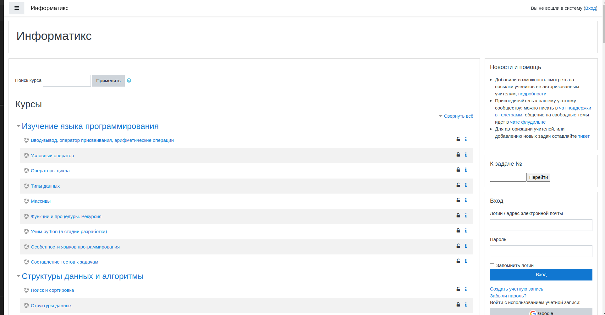
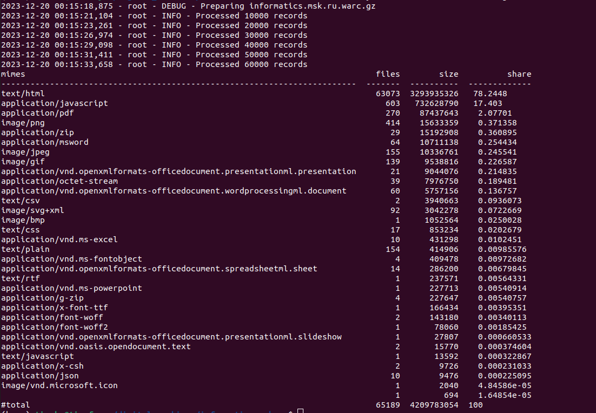

# acmp.ru

## О сайте

Как уже было сказано, [`informatics.msk.ru`](https://informatics.msk.ru/) - сайт, включающий в себя как теорию по базовым аспектам программирования, так и задачи с системой проверок, позволяющие отточить теорию.

Так выглядит главная страница сайта:


Все данные, полученные после архивации, лежат [здесь](https://drive.google.com/drive/folders/1NrpRb4PQu-lcl1lY341V1OzecVo8t-GR?usp=sharing)

## Метаданные

Пользуемся инструментом [`metawarc`](https://github.com/datacoon/metawarc).

### `metadata`
Теперь посмотрим на результат выполнения метода `metadata`.

Запускаем его следующей командой:
```bash
metawarc metadata --output informatics.jsonl informatics.msk.ru.warc.gz
```

В итоге были собраны следующие метаданные (представлен сниппет):
```json
{"filename": "sourcecode-24", "ext": "png", "url": "https://informatics.msk.ru/theme/image.php/boost/core/1695554819/f/sourcecode-24", "mime": "image/png", "metadata": {"Metadata": {"Image width": "24 pixels", "Image height": "24 pixels", "Bits/pixel": "32", "Pixel format": "RGBA", "Compression rate": "1.8x", "Compression": "deflate", "MIME type": "image/png", "Endianness": "Big endian"}}, "error": false, "source": "informatics.msk.ru.warc.gz"}

{"filename": "%d0%bf%d0%b8%d1%82%d0%be%d0%bd.png", "ext": "png", "url": "https://informatics.msk.ru/pluginfile.php/1500202/course/overviewfiles/%D0%BF%D0%B8%D1%82%D0%BE%D0%BD.png", "mime": "image/png", "metadata": {"Metadata": {"Image width": "900 pixels", "Image height": "539 pixels", "Bits/pixel": "32", "Pixel format": "RGBA", "Compression rate": "111.7x", "Compression": "deflate", "MIME type": "image/png", "Endianness": "Big endian"}}, "error": false, "source": "informatics.msk.ru.warc.gz"}

{"filename": "pdf-24", "ext": "png", "url": "https://informatics.msk.ru/theme/image.php/boost/core/1695554819/f/pdf-24", "mime": "image/png", "metadata": {"Metadata": {"Image width": "24 pixels", "Image height": "24 pixels", "Bits/pixel": "32", "Pixel format": "RGBA", "Compression rate": "1.8x", "Compression": "deflate", "MIME type": "image/png", "Endianness": "Big endian"}}, "error": false, "source": "informatics.msk.ru.warc.gz"}
```


### `analyze`
Теперь посмотрим на результат выполнения метода `analyze`.

Запускаем его следующей командой:
```bash
 metawarc analyze informatics.msk.ru.warc.gz
```

Получились следующее:

