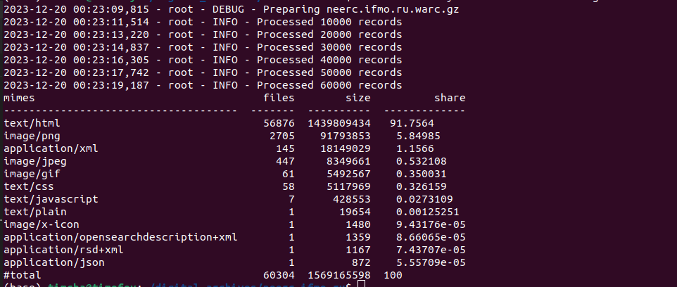

# acmp.ru

## О сайте

Как уже было сказано, [`neerc.ifmo.ru`](http://neerc.ifmo.ru/wiki/index.php?title=%D0%97%D0%B0%D0%B3%D0%BB%D0%B0%D0%B2%D0%BD%D0%B0%D1%8F_%D1%81%D1%82%D1%80%D0%B0%D0%BD%D0%B8%D1%86%D0%B0) - сайт для углубленного изучения различных алгоритмов и, в целом, всего, связанного с Computer Science.

Так выглядит главная страница сайта:


Все данные, полученные после архивации, лежат [здесь](https://drive.google.com/drive/folders/1scVL2Ps53Ws1RvLDkmZQsMItvN7EWu_F?usp=sharing)

## Метаданные

Пользуемся инструментом [`metawarc`](https://github.com/datacoon/metawarc).

### `metadata`
Теперь посмотрим на результат выполнения метода `metadata`.

Запускаем его следующей командой:
```bash
metawarc metadata --output neerc.jsonl neerc.ifmo.ru.warc.gz
```

В итоге были собраны следующие метаданные (представлен сниппет):
```json
{"filename": "poweredby_mediawiki_176x62.png", "ext": "png", "url": "http://neerc.ifmo.ru/wiki/resources/assets/poweredby_mediawiki_176x62.png", "mime": "image/png", "metadata": {"Metadata": {"Image width": "176 pixels", "Image height": "62 pixels", "Bits/pixel": "32", "Pixel format": "RGBA", "Compression rate": "5.2x", "Compression": "deflate", "MIME type": "image/png", "Endianness": "Big endian"}}, "error": false, "source": "neerc.ifmo.ru.warc.gz"}

{"filename": "poweredby_mediawiki_88x31.png", "ext": "png", "url": "http://neerc.ifmo.ru/wiki/resources/assets/poweredby_mediawiki_88x31.png", "mime": "image/png", "metadata": {"Metadata": {"Image width": "88 pixels", "Image height": "31 pixels", "Bits/pixel": "32", "Pixel format": "RGBA", "Compression rate": "3.2x", "Compression": "deflate", "MIME type": "image/png", "Endianness": "Big endian"}}, "error": false, "source": "neerc.ifmo.ru.warc.gz"}

{"filename": "poweredby_mediawiki_132x47.png", "ext": "png", "url": "http://neerc.ifmo.ru/wiki/resources/assets/poweredby_mediawiki_132x47.png", "mime": "image/png", "metadata": {"Metadata": {"Image width": "132 pixels", "Image height": "47 pixels", "Bits/pixel": "32", "Pixel format": "RGBA", "Compression rate": "4.3x", "Compression": "deflate", "MIME type": "image/png", "Endianness": "Big endian"}}, "error": false, "source": "neerc.ifmo.ru.warc.gz"}
```


### `analyze`
Теперь посмотрим на результат выполнения метода `analyze`.

Запускаем его следующей командой:
```bash
 metawarc analyze neerc.ifmo.ru.warc.gz
```

Получились следующее:

